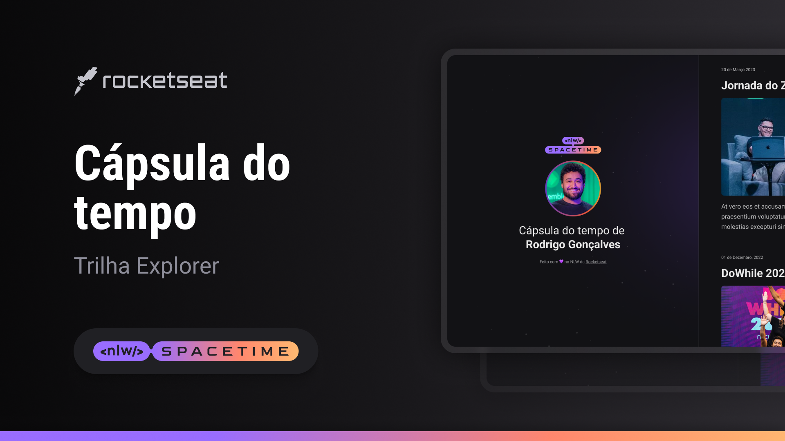

<<<<<<< HEAD

## Projeto💻

Esse é um projeto web resposivo de uma cápsula do tempo parar exibir memorias.

## Tecnologias🚀

Esse Projeto foi desenvolvido duranto a semana NLW da Rocketseat com as seguintes tecnologias:

-HMTL
-CSS
-Git e Github

## Layout 🏷️

Você pode visualizar o layout do projeto através
[desse link] ()
É necessario ter uma conta no figma
=======

  

>>>>>>> 021bd9023dc188a4024c45b3952e214a5ad77208
